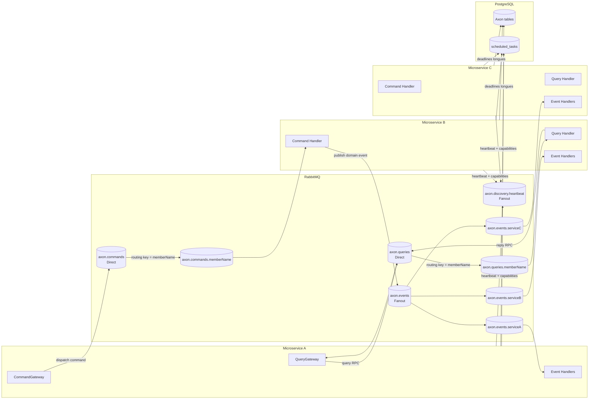

# Axon Distributed Spring Boot Starter

Starter Spring Boot pour exécuter Axon Framework en mode distribué **sans Axon Server**, en s'appuyant sur **RabbitMQ** (transport) et **PostgreSQL** (persistance Axon + deadlines longues via db-scheduler).

## Fonctionnalités principales

- Remplace le transport Axon Server par RabbitMQ tout en conservant les API Axon (`CommandGateway`, `QueryBus`, processors d'events).
- Auto-configuration activable via `axon.distributed.enabled=true`.
- **Commandes distribuées** via exchange RabbitMQ `direct` + routage par membre (`memberName`).
- **Queries distribuées** via exchange RabbitMQ `direct` + RPC avec sérialisation du `ResponseType`.
- **Events diffusés** via exchange RabbitMQ `fanout` + queue durable par service (`axon.events.<serviceName>`).
- **Service discovery** par heartbeat RabbitMQ (capabilities commandes/queries + purge des membres stale).
- **Deadline management hybride** :
  - court terme (`< 5 min`) en mémoire,
  - long terme en base via `DbSchedulerDeadlineManager`.
- Injection automatique des migrations Flyway Axon (`classpath:db/migration/axon`).

## Architecture (vue rapide)

- Entrée auto-config : `axon-distributed-spring-boot-starter/src/main/java/com/axon/distributed/autoconfigure/AxonDistributedAutoConfiguration.java`
- Imports Spring Boot :
  - `axon-distributed-spring-boot-starter/src/main/resources/META-INF/spring/org.springframework.boot.autoconfigure.AutoConfiguration.imports`
  - `axon-distributed-spring-boot-starter/src/main/resources/META-INF/spring.factories`
- Configuration transport :
  - commandes : `config/CommandBusConfiguration.java`, `command/SpringCommandBusConnector.java`
  - queries : `config/QueryBusConfiguration.java`, `query/DistributedQueryBus.java`
  - events : `config/EventBusConfiguration.java`
- Discovery/routage :
  - `discovery/InMemoryMemberRegistry.java`
  - `router/MemberRouter.java`

## Guide d'utilisation

### 1) Ajouter la dépendance starter

Si le starter est installé/publish dans votre repository Maven interne :

```xml
<dependency>
  <groupId>io.github.cnadjim</groupId>
  <artifactId>axon-distributed-spring-boot-starter</artifactId>
  <version>1.0.0-SNAPSHOT</version>
</dependency>
```

### 2) Configurer l'application

Exemple minimal `application.yml` côté microservice :

```yaml
spring:
  application:
    name: billing-service

  datasource:
    url: jdbc:postgresql://localhost:5432/billing_db
    username: guest
    password: guest

  rabbitmq:
    host: localhost
    port: 5672
    username: guest
    password: guest

axon:
  distributed:
    enabled: true
    command-bus:
      exchange: axon.commands
    query-bus:
      exchange: axon.queries
    event-bus:
      exchange: axon.events
    service-discovery:
      exchange: axon.discovery.heartbeat
      heartbeat-interval: 5000
      stale-threshold: 15000
```

### 3) Démarrer l'infrastructure

Au minimum :
- RabbitMQ accessible par les microservices
- PostgreSQL accessible (Flyway crée les tables Axon/db-scheduler)

### 4) Utiliser Axon normalement

Côté code applicatif, continuez d'utiliser les composants Axon standards :
- `CommandGateway` pour dispatch de commandes
- `QueryGateway`/`QueryBus` pour queries
- event handlers / processors Axon

Le starter se charge du transport distribué et du routage.

## Flux command/query/event (Mermaid)



## Commandes utiles (dev)

```bash
mvn clean verify
mvn -pl axon-distributed-spring-boot-starter -am clean verify
mvn -pl axon-distributed-spring-boot-starter -am -DskipTests compile
```

## Points d'attention

- Le starter force `axon.axonserver.enabled=false` quand `axon.distributed.enabled=true`.
- Contrats de nommage à préserver :
  - `axon.commands.<memberName>`
  - `axon.queries.<memberName>`
  - `axon.events.<serviceName>`
- Les deadlines longues dépendent de la sérialisation Axon (`eventSerializer`) et de `scheduled_tasks` en base.


